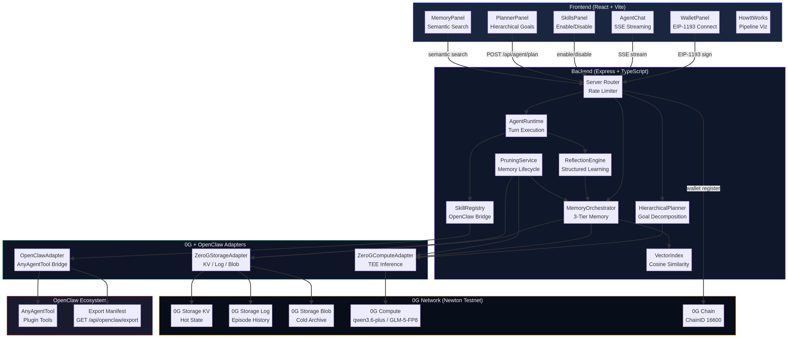

# CLAW_MACHINE v5 — Self-Improving Agent Framework on 0G

> **EthGlobal 2025 — Best Agent Framework, Tooling & Core Extensions track**

A production-ready, self-improving agent **framework** built on 0G Storage + 0G Compute, with full OpenClaw plugin compatibility. CLAW_MACHINE is not just an app — it is an installable SDK that any developer can use to build their own agents.

## Framework Packages

| Package | Install | Description |
|---------|---------|-------------|
| `@claw/core` | `npm i @claw/core` | Core SDK — `createAgent`, `AgentBuilder`, `defineSkill`, `definePlugin`, built-in mock adapters |
| `@claw/plugin-0g` | `npm i @claw/plugin-0g` | 0G Storage (KV/Log/Blob) + 0G Compute (TEE inference) as a one-line plugin |
| `@claw/plugin-openclaw` | `npm i @claw/plugin-openclaw` | Bidirectional `AnyAgentTool` ↔ `SkillDefinition` bridge |
| `@claw/react` | `npm i @claw/react` | `AgentProvider`, `useAgent`, `useAgentStream`, `useWallet` React hooks |
| `@claw/cli` | `npm i -g @claw/cli` | `claw init`, `claw skill add`, `claw plugin add`, `claw dev` |

## 5-Minute Quick Start

```bash
# Scaffold a new agent project
npx @claw/cli init my-agent
cd my-agent && cp .env.example .env && npm install && npm run dev
```

Or use the SDK directly:

```ts
import { AgentBuilder, defineSkill } from "@claw/core";
import { zeroGPlugin } from "@claw/plugin-0g";
import { openClawPlugin } from "@claw/plugin-openclaw";

const agent = await new AgentBuilder()
  .setName("MyAgent")
  .setSystemPrompt("You are a DeFi assistant on 0G.")
  .use(zeroGPlugin({ rpc: process.env.EVM_RPC! }))
  .use(openClawPlugin({ tools: [myOpenClawTool] }))
  .skill(myCustomSkill)
  .enableReflection()
  .build();

const result = await agent.run({ message: "What can you do?" });
console.log(result.output);
await agent.destroy();
```

See `examples/frameworkDemo.ts` for a full working demo (no credentials needed — runs in mock mode).

- composable TypeScript runtime (`AgentRuntime`)
- **three-tier persistent memory** (0G Storage KV / Log / Blob)
- **hierarchical planning** with dependency graph execution
- **semantic memory retrieval** via in-process VectorIndex
- **OpenClaw bidirectional bridge** (`AnyAgentTool` ↔ SkillRegistry)
- **TEE-verifiable inference** via 0G Compute
- skill registry + execution traces + SSE streaming
- wallet-aware React DApp UI with 7 sidebar panels

## Why this matters

Most demo agents are stateless chat wrappers. OpenAgents focuses on continuity:
- it stores structured memory per session/wallet
- it generates structured reflections after failures
- it retrieves and summarizes prior context for future turns
- it surfaces traces and lessons in the UI for transparent behavior

## Architecture



```text
React DApp (frontend)
  WalletPanel | AgentChat (SSE) | SkillsPanel | PlannerPanel
  MemoryPanel | InsightsPanel | TxHistory | HowItWorks
        |
        v
Express API (backend)  —  rate limiter + Zod validation
  /api/agent/* /api/storage/* /api/wallet/*
  /api/openclaw/* /api/memory/orchestrator/*
        |
        v
Agent Runtime (TypeScript)
  AgentRuntime
    -> SkillRegistry <-> OpenClawAdapter (AnyAgentTool bridge)
    -> MemoryOrchestrator (Hot KV / Warm Log / Cold Archive)
       -> VectorIndex (cosine similarity retrieval)
       -> PruningService (LRU eviction + summarization)
    -> HierarchicalPlanner (goal decomposition + parallel execution)
    -> ReflectionEngine (structured JSON reflections)
    -> EventBus (trace + observability)
        |
        +--> 0G Chain (chainId 16600, wallet identity)
        +--> ZeroGStorageAdapter (KV stream / Log / Blob + SHA-256 hash)
        +--> ZeroGComputeAdapter (TEE inference, provider acknowledgment)
        +--> OpenClaw ecosystem (plugin tools, export manifest)
```

## Quick Start

### Prerequisites
- Node.js 18+
- npm
- MetaMask (optional but recommended for full demo)

### Install and run
```bash
npm install
cp .env.example .env
npm run dev
```

- Frontend: `http://localhost:3000`
- Backend: `http://localhost:3001`

### Build
```bash
npm run build
```

## Demo flow (under 3 minutes)

1. Open app, connect wallet.
2. Ask: `Summarize my wallet activity`.
3. Ask: `Run a swap simulation`.
4. Ask: `Show the last mistake you learned from`.
5. Open memory/reflection panel and show continuity.
6. Show tx history + skill execution trace + backend status.

## API surface (v4)

| Method | Path | Description |
|--------|------|-------------|
| GET | `/health` | Liveness + heap/RSS/skill stats |
| GET | `/ready` | Readiness + provider health |
| GET | `/api/config` | Runtime config visibility |
| GET | `/api/agent/status` | Agent status + skills list |
| POST | `/api/agent/run` | Run agent turn (REST) |
| POST | `/api/agent/stream` | Run agent turn (SSE streaming) |
| POST | `/api/agent/plan` | Create + execute hierarchical plan |
| GET | `/api/agent/plans` | List recent plans |
| GET | `/api/agent/plans/:id` | Get specific plan |
| GET | `/api/agent/skills` | List all skills |
| GET | `/api/agent/skills/:id` | Get one skill manifest |
| POST | `/api/agent/skills/:id/enable` | Enable skill at runtime |
| POST | `/api/agent/skills/:id/disable` | Disable skill at runtime |
| POST | `/api/agent/skills/execute` | Direct skill execution |
| GET | `/api/agent/insights` | Memory stats + reflections + events |
| GET | `/api/agent/history` | Conversation history |
| DELETE | `/api/agent/history` | Clear history |
| GET | `/api/memory/search` | Semantic search |
| GET | `/api/memory/stats` | Memory type breakdown |
| POST | `/api/memory/pin/:id` | Pin record |
| DELETE | `/api/memory/:id` | Soft-delete record |
| GET | `/api/memory/orchestrator/stats` | MemoryOrchestrator stats |
| POST | `/api/memory/orchestrator/search` | Semantic search via orchestrator |
| POST | `/api/memory/orchestrator/reflect` | Trigger reflection |
| GET | `/api/openclaw/tools` | List skills as OpenClaw tools |
| POST | `/api/openclaw/tools/execute` | Execute OpenClaw tool |
| GET | `/api/openclaw/export` | Full OpenClaw plugin manifest |
| POST | `/api/storage/upload` | Upload artifact to 0G Storage |
| GET | `/api/storage/download/:hash` | Download by root hash |
| POST | `/api/wallet/register` | Register wallet with EIP-191 signature |
| GET | `/api/wallet/:addr/config` | Get wallet config |
| PUT | `/api/wallet/:addr/config` | Update wallet config |

## Memory and reflection model

### Memory categories
- `session_state`
- `conversation_turn`
- `task_result`
- `reflection`
- `skill_execution`
- `wallet_profile`
- `artifact`
- `error_event`
- `summary`

### Reflection shape
- source turn id
- task type
- success/failure result
- root cause and mistake summary
- corrective advice
- confidence + severity + tags
- related memory IDs
- next best action

## 0G integration clarity

| 0G Primitive | Usage |
|-------------|-------|
| 0G Storage KV stream | Hot session state (fast reads/writes per wallet) |
| 0G Storage Log | Append-only episode history (auditable, ordered) |
| 0G Storage Blob | Compressed long-term memory archive + SHA-256 verification |
| 0G Compute | LLM inference (qwen3.6-plus, GLM-5-FP8, DeepSeek-V3.1) |
| 0G Compute TEE | Verifiable reflection generation with provider signature |
| 0G Compute Embeddings | 1536-dim vectors for semantic memory retrieval |
| 0G Chain (16600) | Wallet identity, EIP-191 signed registration, explorer links |

Fallback modes are explicit:
- compute unavailable → mock compute path (degraded)
- storage unavailable → in-memory mode (degraded)
- wallet disconnected → read-only exploration still works

## OpenClaw integration

```typescript
// Register any OpenClaw AnyAgentTool as a Claw Machine skill
const adapter = new OpenClawAdapter(skillRegistry);
adapter.registerTool(myOpenClawTool, { tags: ['openclaw', 'defi'] });

// Export all Claw Machine skills as OpenClaw tools
const tools = adapter.exportAllAsOpenClawTools();

// REST endpoint for OpenClaw plugin manifest
// GET /api/openclaw/export
```

## Example agent

See `examples/supportAgent.ts` for a working example:

```bash
cd examples && npx ts-node supportAgent.ts
```

Demonstrates: 3-turn conversation, memory accumulation, hierarchical planning, full stats output.

## Repository layout

```text
backend/src/
  config/
  core/
  events/
  memory/
  reflection/
  skills/
  providers/
  types/
  server.ts
frontend/src/
  components/
  hooks/
  services/
  App.jsx
shared/
  types.ts
```

## Environment variables

See `.env.example`. Key values:
- `PORT`
- `CORS_ORIGIN`
- `OG_RPC_URL`
- `OG_CHAIN_ID`
- `OG_STORAGE_RPC`
- `OG_COMPUTE_RPC`
- `OG_COMPUTE_MODE` (`mock` or `production`)
- `OG_STORAGE_MODE` (`memory` or `production`)

## Quality gates

- TypeScript build passes for backend
- Vite production build passes for frontend
- request IDs + structured logs for observability
- consistent JSON error format for API responses

## Error handling and degraded modes

### Error model
- Backend normalizes failures into typed `AppError` objects with stable codes.
- API errors use a consistent envelope:
  - `ok: false`
  - `error.code`, `error.message`, `error.category`
  - `error.recoverable`, `error.retryable`
  - `error.requestId` and `error.details`

### Recovery behavior
- Validation issues return 4xx with actionable fields.
- Provider/network failures are normalized and may retry with bounded backoff.
- Agent runtime phase failures are tracked in trace output and may degrade gracefully.
- Reflection and persistence failures do not always fail the primary user answer.

### Fallback visibility
- Mock/degraded modes are exposed via:
  - `GET /ready`
  - `GET /api/agent/status`
  - frontend diagnostics banner and runtime traces

### Troubleshooting quick notes
- Wallet not connecting: verify wallet extension and 0G testnet chain selection.
- Storage download fails: validate hash format and whether artifact exists locally.
- Compute unavailable: run in demo/mock mode with `OG_COMPUTE_MODE=mock`.
- Backend error details: inspect `requestId` from UI and logs for correlation.

## Roadmap

- Add integration tests for `/api/agent/run` and reflection loops
- Persist memory snapshots with schema migration support
- Add no-code visual agent builder with one-click 0G deployment
- Add multi-modal reasoning (image/audio input via 0G Compute)
- Add agent-to-agent communication via 0G Storage message queues
- Add on-chain skill registry contract on 0G Chain

## License

MIT
