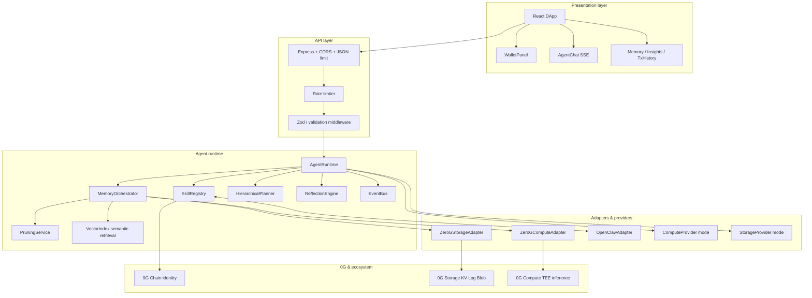
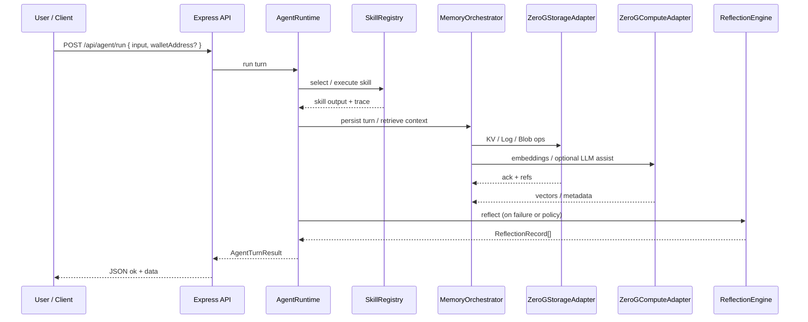
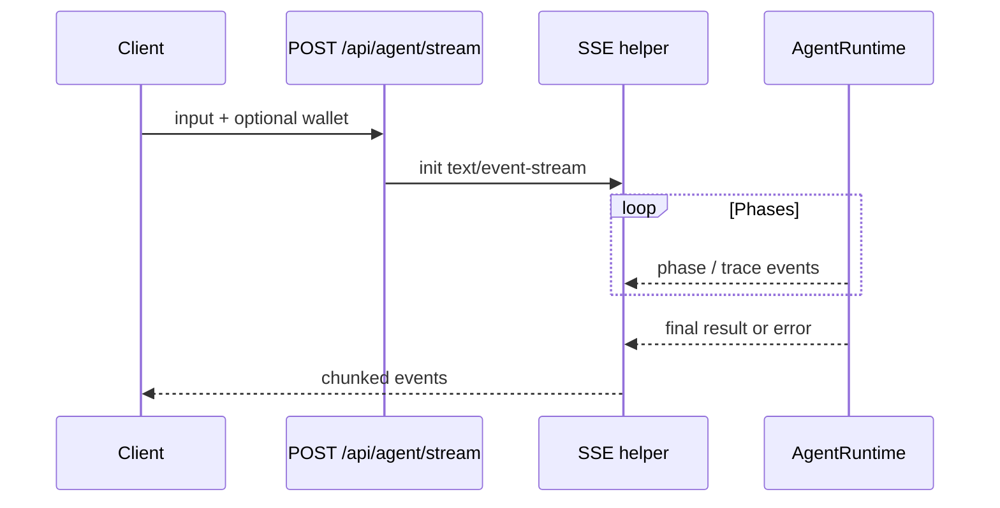
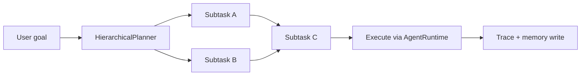
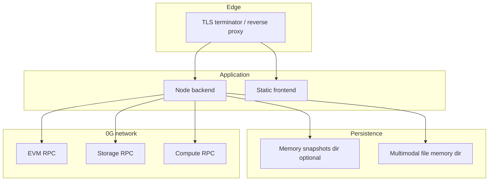
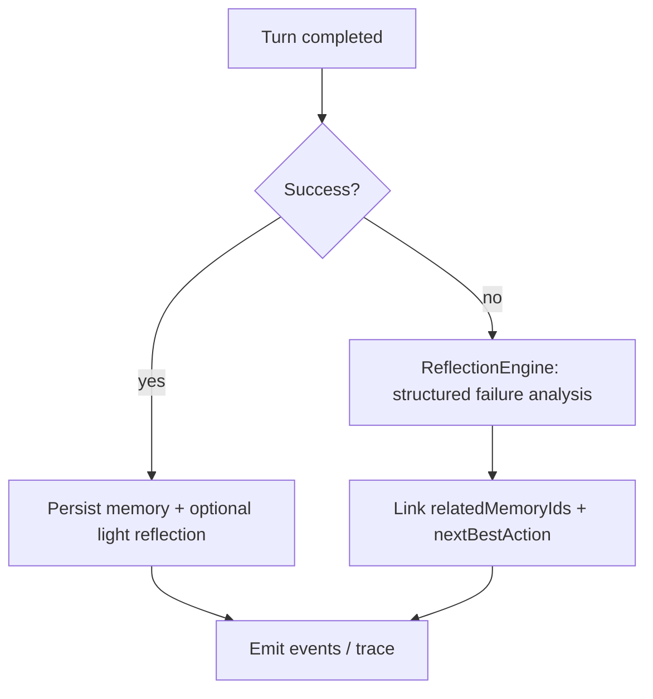
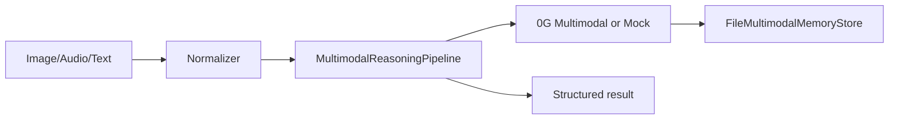
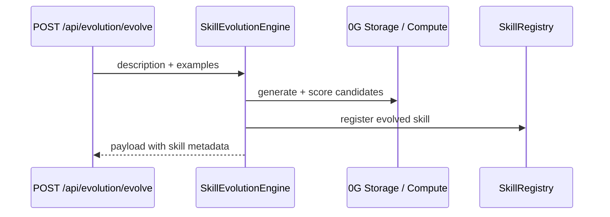
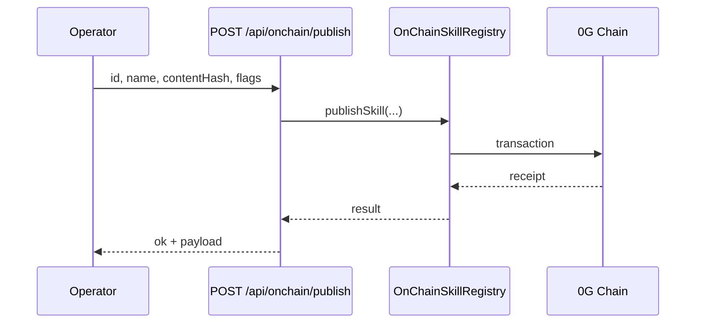

# CLAW_MACHINE — Self-Improving Agent Framework on 0G

> **Hackathon track:** *Best Agent Framework, Tooling & Core Extensions*  
> **Repository:** [github.com/lucylow/CLAW_MACHINE](https://github.com/lucylow/CLAW_MACHINE)

**CLAW_MACHINE** is a production-oriented, **self-improving agent framework** built on **[0G Storage](https://docs.0g.ai/)** and **[0G Compute](https://docs.0g.ai/)**, with first-class **[OpenClaw](https://github.com/openclaw/openclaw)** interoperability. It is not a single demo chatbot: it is an **installable SDK** (`@claw/core`), plugin ecosystem, CLI scaffolder, and reference **React** DApp that together show how to run agents with **durable memory**, **hierarchical planning**, **structured reflection**, and optional **TEE-backed** inference.

This document is the **definitive technical guide** for judges, integrators, and operators. It prioritizes **architecture transparency**, **API completeness**, and **degraded-mode behavior** over marketing copy.

---

## Table of contents

1. [Header & value proposition](#1-header--value-proposition)
2. [Framework packages](#2-framework-packages)
3. [Deep dive architecture](#3-deep-dive-architecture)
4. [Data-flow diagrams (Mermaid)](#4-data-flow-diagrams-mermaid)
5. [ASCII system map (improved)](#5-ascii-system-map-improved)
6. [Core concepts glossary](#6-core-concepts-glossary)
7. [Developer-first installation & onboarding](#7-developer-first-installation--onboarding)
8. [Monorepo layout](#8-monorepo-layout)
9. [Comprehensive REST API specification](#9-comprehensive-rest-api-specification)
10. [Authentication, headers & correlation](#10-authentication-headers--correlation)
11. [Structured error responses](#11-structured-error-responses)
12. [Memory & reflection deep dive](#12-memory--reflection-deep-dive)
13. [0G integration: KV, Log, Blob & compute](#13-0g-integration-kv-log-blob--compute)
14. [Operational transparency: fallbacks & integrity](#14-operational-transparency-fallbacks--integrity)
15. [OpenClaw integration](#15-openclaw-integration)
16. [SDK quick reference](#16-sdk-quick-reference)
17. [Demo flow & examples](#17-demo-flow--examples)
18. [Environment variables](#18-environment-variables)
19. [Quality gates & observability](#19-quality-gates--observability)
20. [Project roadmap](#20-project-roadmap)
21. [License & references](#21-license--references)

---

## 1. Header & value proposition

### Elevator pitch

Most agent demos are **stateless wrappers** around a single LLM call. CLAW_MACHINE treats an agent as a **long-lived system**: it **writes** structured memory, **reads** it back via retrieval and orchestration, **reflects** on failures with typed records, and optionally anchors artifacts and inference to **0G** primitives. **Hierarchical planning** decomposes goals into dependency-aware steps; **OpenClaw** tools can be imported and exported without rewriting skill boundaries.

### Who this is for

| Audience | What they get |
|----------|----------------|
| **Hackathon judges** | Clear architecture, explicit fallbacks, traceable memory/reflection model |
| **Enterprise developers** | REST surface, error envelopes, readiness endpoints, workspace packages |
| **0G ecosystem builders** | Storage/compute adapters, chain-aligned config, explorer-friendly flows |

### Differentiators (honest scope)

- **Three-tier memory story** mapped to **KV** (hot), **Log** (warm, append-only), **Blob** (cold, content-addressed) — see [§13](#13-0g-integration-kv-log-blob--compute).
- **MemoryOrchestrator** coordinates retrieval, pruning, and reflection-friendly persistence — see [§3](#3-deep-dive-architecture).
- **ReflectionEngine** emits **structured JSON** reflections (success/failure, root cause, next action) — schema in [§12](#12-memory--reflection-deep-dive).
- **HierarchicalPlanner** for goal decomposition and plan execution — see diagrams in [§4](#4-data-flow-diagrams-mermaid).
- **Sealed / verifiable inference** path via **0G Compute** (metadata and TEE acknowledgment flows in adapters; mock mode when disconnected).
- **OpenClaw** bridge: register `AnyAgentTool`-style tools as skills and export manifests — [§15](#15-openclaw-integration).

---

## 2. Framework packages

| Package | Install | Description |
|---------|---------|-------------|
| `@claw/core` | `npm i @claw/core` | Core SDK — `createAgent`, `AgentBuilder`, `defineSkill`, `definePlugin`, mock adapters |
| `@claw/plugin-0g` | `npm i @claw/plugin-0g` | **0G Storage** (**KV** / **Log** / **Blob**) + **0G Compute** (**TEE** inference) as a plugin |
| `@claw/plugin-openclaw` | `npm i @claw/plugin-openclaw` | Bidirectional **OpenClaw** `AnyAgentTool` ↔ skill bridge |
| `@claw/react` | `npm i @claw/react` | `AgentProvider`, `useAgent`, `useAgentStream`, `useWallet` hooks |
| `@claw/cli` | `npm i -g @claw/cli` | `claw init`, `claw skill add`, `claw plugin add`, `claw dev` |

Monorepo scripts (root `package.json`):

```bash
npm run install-all   # root + backend + frontend
npm run dev           # backend :3001 + frontend :3000
npm run build
npm run demo          # examples/frameworkDemo.ts via tsx
```

---

## 3. Deep dive architecture

### 3.1 Layers



### 3.2 Memory orchestration semantics

The **MemoryOrchestrator** sits between the **Agent** and **0G** adapters:

- **Hot path**: session-scoped state suitable for **KV**-backed fast read/write (wallet- or session-keyed).
- **Warm path**: append-only **Log** episodes for auditability and ordering (turns, skill traces).
- **Cold path**: **Blob** archives for large or summarized payloads; **SHA-256** / content addressing for verification.
- **Semantic layer**: in-process **VectorIndex** (cosine similarity) for lesson and memory retrieval; works with embeddings from **0G Compute** when configured.
- **Pruning**: **PruningService** applies LRU-style eviction and summarization so hot tiers stay bounded.

### 3.3 Reflection engine

The **ReflectionEngine** produces **ReflectionRecord** objects after turns or task outcomes. When **0G Compute** is available, reflections can be attributed to a compute reference (`computeRef`) for traceability; otherwise a rule-based or local path may apply. Reflections are designed **not to block** the primary user-visible answer when persistence fails (best-effort semantics — see [§14](#14-operational-transparency-fallbacks--integrity)).

### 3.4 TEE compute flow (conceptual)

**TEE** inference here means: the compute adapter requests model output from **0G Compute**, receives structured metadata (tokens, provider hints, acknowledgment / signature fields depending on deployment), and surfaces that to the runtime for logging and optional verification. In **mock** mode, the same code paths execute with deterministic stub responses so CI and demos do not require live **0G** endpoints.

---

## 4. Data-flow diagrams (Mermaid)

### 4.1 Agent turn: REST / orchestration



### 4.2 Streaming (SSE)



### 4.3 Planner: hierarchical decomposition



### 4.4 Deployment topology (production-oriented)



---

## 5. ASCII system map (improved)

```text
┌──────────────────────────────────────────────────────────────────────────────┐
│  React DApp (frontend)                                                        │
│  WalletPanel │ AgentChat (SSE) │ SkillsPanel │ PlannerPanel │ Builder          │
│  MemoryPanel │ InsightsPanel  │ TxHistory   │ HowItWorks   │ ErrorBanner      │
└──────────────────────────────────────────────────────────────────────────────┘
         │  HTTPS (VITE_API_BASE_URL)    headers: x-request-id, x-wallet-address
         ▼
┌──────────────────────────────────────────────────────────────────────────────┐
│  Express API (backend)                                                       │
│  CORS · globalLimiter · agentRunLimiter · JSON body · requestId middleware   │
│  Routes: /health /ready /api/config /api/agent/* /api/memory/* /api/openclaw │
│          /api/storage/* /api/wallet/* /api/evolution /api/onchain /api/builder│
│          /api/deploy /api/agent/multimodal /api/skills/registry (optional)   │
└──────────────────────────────────────────────────────────────────────────────┘
         │
         ▼
┌──────────────────────────────────────────────────────────────────────────────┐
│  Agent Runtime (TypeScript)                                                  │
│  AgentRuntime ─┬─ SkillRegistry ◄──► OpenClawAdapter (AnyAgentTool bridge)   │
│                ├─ MemoryOrchestrator ─ Hot KV / Warm Log / Cold Blob          │
│                │       ├─ VectorIndex (semantic retrieval)                   │
│                │       └─ PruningService (LRU + summarization)               │
│                ├─ HierarchicalPlanner (goal DAG + execution)                 │
│                ├─ ReflectionEngine (structured reflections)                  │
│                └─ EventBus (traces + observability)                          │
└──────────────────────────────────────────────────────────────────────────────┘
         │                    │                    │
         ▼                    ▼                    ▼
   0G Chain (wallet)   ZeroGStorageAdapter   ZeroGComputeAdapter
   chainId / RPC       KV · Log · Blob       TEE inference · embeddings
```

---

## 6. Core concepts glossary

| Term | Meaning in CLAW_MACHINE |
|------|-------------------------|
| **TEE** | Trusted execution context for **0G Compute** inference; responses carry provider metadata for verification workflows |
| **KV** | Key-value style **hot** tier for session-scoped state |
| **Log** | Append-only **warm** tier for ordered episodes / audit trail |
| **Blob** | Content-addressed **cold** tier for large artifacts; hash verification |
| **Sealed inference** | Multimodal / compute path that can run against a configured HTTP **0G** multimodal endpoint (see `ZERO_G_MULTIMODAL_*` in `.env.example`) |
| **Hierarchical planning** | Goal decomposition into dependent subtasks executed through the planner + runtime |
| **Reflection** | Post-turn structured analysis stored as **ReflectionRecord** |

---

## 7. Developer-first installation & onboarding

### 7.1 Quick start (local demo, under 10 minutes)

**Goal:** run the reference UI + API on localhost with **mock** or **degraded** compute/storage acceptable.

```bash
git clone https://github.com/lucylow/CLAW_MACHINE.git
cd CLAW_MACHINE
npm run install-all
cp .env.example .env
# Optional: set OG_COMPUTE_MODE=production and OG_STORAGE_MODE=production when you have live 0G endpoints
npm run dev
```

- **Frontend:** `http://localhost:3000`
- **Backend:** `http://localhost:3001`

**5-minute SDK-only path** (from published packages):

```bash
npx @claw/cli init my-agent
cd my-agent && cp .env.example .env && npm install && npm run dev
```

### 7.2 Full production deployment

**Goal:** deterministic readiness, real **0G** backends, CORS locked to your origin, and secrets outside the repo.

1. **Configure environment** — copy `.env.example` to `.env` and set:
   - `OG_RPC_URL`, `OG_CHAIN_ID` (default testnet **16600**)
   - `OG_STORAGE_RPC`, `OG_COMPUTE_RPC` or your operator endpoints
   - `OG_COMPUTE_MODE=production`, `OG_STORAGE_MODE=production`
   - `CORS_ORIGIN=https://your-app.example`
   - Optional: `SKILL_REGISTRY_*` for on-chain registry routes
   - Optional: `ZERO_G_MULTIMODAL_ENDPOINT` + API key for multimodal sealed inference
2. **Run behind TLS** — terminate HTTPS at a reverse proxy; forward `x-request-id` and `x-wallet-address` as needed.
3. **Validate readiness** — `GET /ready` and `GET /api/agent/status` must show non-degraded services before traffic cutover.
4. **Observability** — ship structured JSON logs from the backend; correlate via `requestId` ([§10](#10-authentication-headers--correlation)).

**Backend-only production build:**

```bash
cd backend && npm run build && npm run start
```

**Frontend static build:**

```bash
cd frontend && npm run build
# serve dist/ via CDN or static host; set VITE_API_BASE_URL at build time
```

---

## 8. Monorepo layout

```text
CLAW_MACHINE/
├── backend/src/
│   ├── server.ts              # Express app, wiring, global middleware
│   ├── config/env.ts          # computeMode / storageMode / chain
│   ├── core/                  # AgentRuntime, MemoryOrchestrator, planner, pruning
│   ├── memory/                # MemoryStore, snapshots, multimodal memory
│   ├── reflection/           # ReflectionEngine
│   ├── skills/               # SkillRegistry, example skills
│   ├── adapters/             # ZeroG*, OpenClaw*
│   ├── routes/               # skills, memory, planner, openclaw, evolution, onchain, builder
│   ├── api/                  # skillRegistryRoutes, multimodal routes
│   ├── multimodal/           # reasoning pipeline, types, register helper
│   ├── errors/               # AppError, normalization, HTTP mapping
│   └── chain/                # skill registry client (EVM)
├── frontend/src/
│   ├── components/           # Panels, chat, wallet, builder UI
│   ├── hooks/                # useAgentStream, useWallet, useSkillRegistry, useZeroG
│   ├── lib/0g/               # chain, storage, compute helpers
│   └── services/api.js
├── packages/
│   ├── core/                 # @claw/core SDK source
│   └── cli/                  # @claw/cli
├── examples/                 # framework demos & agent examples
└── .env.example
```

The **`packages/core`** tree also contains **evolution**, **multimodal**, **framework**, and **OpenClaw** bridge modules consumed by the backend and external SDK users.

---

## 9. Comprehensive REST API specification

**Conventions**

- Successful responses typically: `{ ok: true, data: ..., meta?: { timestamp, ... } }` (some routes use `payload` — noted below).
- Agent run endpoints may include trace arrays and reflection lists in the body (see runtime types).
- Rate limiting applies to agent run endpoints (`agentRunLimiter`).

### 9.1 Core health & config

| Method | Path | Description |
|--------|------|-------------|
| GET | `/health` | Liveness + memory usage + skill counts |
| GET | `/ready` | Readiness: `compute`, `storage`, `chain` service summary |
| GET | `/api/config` | Non-secret config: version, `computeMode`, `storageMode`, chain, RPC |

### 9.2 Agent execution & history

| Method | Path | Description |
|--------|------|-------------|
| GET | `/api/agent/status` | Runtime model, degraded flags, chain info |
| POST | `/api/agent/run` | Single agent turn (JSON) — rate limited |
| POST | `/api/agent/stream` | SSE streaming turn — rate limited |
| GET | `/api/agent/history` | Conversation history |
| DELETE | `/api/agent/history` | Clear history |
| GET | `/api/agent/insights` | Memory stats + reflections + events |

### 9.3 Skills

Mounted at **`/api/agent/skills`** (`createSkillsRouter`).

| Method | Path | Description |
|--------|------|-------------|
| GET | `/api/agent/skills` | List skills |
| GET | `/api/agent/skills/:id` | Skill manifest |
| POST | `/api/agent/skills/:id/enable` | Enable at runtime |
| POST | `/api/agent/skills/:id/disable` | Disable at runtime |
| POST | `/api/agent/skills/execute` | Direct skill execution |

### 9.4 Planner

| Method | Path | Description |
|--------|------|-------------|
| POST | `/api/agent/plan` | Create + execute hierarchical plan |
| GET | `/api/agent/plans` | List recent plans |
| GET | `/api/agent/plans/:id` | Get plan by id |

### 9.5 Memory (in-process store)

| Method | Path | Description |
|--------|------|-------------|
| GET | `/api/memory/search` | Query params: `sessionId`, `walletAddress`, `type`, `query`, `limit`, `tags` |
| GET | `/api/memory/stats` | Counts by type and importance bands |
| POST | `/api/memory/pin/:id` | Pin record (pruning resistance) |
| DELETE | `/api/memory/:id` | Soft-delete (`importance = 0`) |

### 9.6 Memory orchestrator (0G-backed paths)

| Method | Path | Description |
|--------|------|-------------|
| GET | `/api/memory/orchestrator/stats` | Orchestrator statistics |
| POST | `/api/memory/orchestrator/search` | Body: `{ query, walletAddress?, limit? }` — semantic lesson retrieval |
| POST | `/api/memory/orchestrator/reflect` | Body: `{ input, output, success?, sessionId?, walletAddress? }` |

### 9.7 OpenClaw

| Method | Path | Description |
|--------|------|-------------|
| GET | `/api/openclaw/tools` | List exported tools |
| POST | `/api/openclaw/tools/execute` | Execute mapped tool |
| GET | `/api/openclaw/export` | Plugin manifest for OpenClaw-compatible hosts |

### 9.8 Storage & wallet

| Method | Path | Description |
|--------|------|-------------|
| POST | `/api/storage/upload` | Upload artifact (demo cache + metadata) |
| GET | `/api/storage/download/:hash` | Download by `0x` + 64 hex chars |
| POST | `/api/wallet/register` | EIP-191 style registration payload |
| GET | `/api/wallet/:addr/config` | Per-wallet config |
| PUT | `/api/wallet/:addr/config` | Merge-update config |

### 9.9 Evolution & on-chain registry

| Method | Path | Description |
|--------|------|-------------|
| POST | `/api/evolution/evolve` | Evolve skill from description |
| GET | `/api/evolution/skills` | List evolved skills |
| POST | `/api/evolution/load` | Reload evolved skills from storage |
| GET | `/api/evolution/status` | Engine status / scores |
| GET | `/api/onchain/skills` | List on-chain skills (`limit` query) |
| POST | `/api/onchain/publish` | Publish skill metadata + `contentHash` |
| POST | `/api/onchain/endorse/:key` | Endorse skill |
| GET | `/api/onchain/skill/:id` | Fetch skill by id |

### 9.10 Builder & deploy

| Method | Path | Description |
|--------|------|-------------|
| POST | `/api/builder/deploy` | Deploy visual pipeline snapshot |
| GET | `/api/builder/pipelines` | List pipelines |
| GET | `/api/builder/pipeline/:id` | Get pipeline |
| DELETE | `/api/builder/pipeline/:id` | Delete pipeline |
| POST | `/api/deploy/0g` | Zero-G deploy helper (see `routes/deploy-zero-g.ts`) |

### 9.11 Multimodal (agent)

Mounted at **`/api/agent/multimodal`** (large JSON limit).

| Method | Path | Description |
|--------|------|-------------|
| POST | `/api/agent/multimodal/run` | Run multimodal reasoning pipeline |
| POST | `/api/agent/multimodal/upload/image` | Normalize image upload (base64) |
| POST | `/api/agent/multimodal/upload/audio` | Normalize audio upload (base64) |

### 9.12 Skill registry contract API (optional)

When `SKILL_REGISTRY_ADDRESS`, `SKILL_REGISTRY_RPC_URL`, and `SKILL_REGISTRY_CHAIN_ID` are set, routes mount at **`/api/skills/registry`**:

| Method | Path | Description |
|--------|------|-------------|
| GET | `/api/skills/registry/skills` | List registry skills |
| GET | `/api/skills/registry/skills/search` | Search |
| GET | `/api/skills/registry/skills/owner/:owner` | By owner |
| GET | `/api/skills/registry/skills/:skillId` | Detail |
| POST | `/api/skills/registry/skills/register` | Register (auth) |
| POST | `/api/skills/registry/skills/:skillId/version` | New version |
| POST | `/api/skills/registry/skills/:skillId/activate` | Activate |
| POST | `/api/skills/registry/skills/:skillId/approve` | Approve |
| POST | `/api/skills/registry/skills/:skillId/usage` | Usage event |

### 9.13 Example success envelope

```json
{
  "ok": true,
  "data": {
    "status": "online",
    "degraded": false
  },
  "meta": {
    "timestamp": 1710000000000
  }
}
```

---

## 10. Authentication, headers & correlation

The reference server is **wallet-oriented**, not OAuth-centric. Use headers consistently:

| Header | Purpose |
|--------|---------|
| `x-request-id` | Optional client-supplied id; server generates UUID if absent; echoed on response |
| `x-wallet-address` | Identifies end-user wallet for logging and optional registry auth |
| `Content-Type` | `application/json` for JSON bodies |
| `Authorization` | Allowed by CORS config; use when you add your own auth layer |

**Skill registry write routes** validate `x-wallet-address` as a checksummable `0x` + 40 hex via `requireAuth` hook.

---

## 11. Structured error responses

### 11.1 Primary API envelope (`AppError` / `toApiErrorResponse`)

```json
{
  "ok": false,
  "error": {
    "code": "API_001_INVALID_REQUEST",
    "message": "human readable message",
    "category": "validation",
    "recoverable": true,
    "retryable": false,
    "requestId": "uuid",
    "details": {
      "operation": "post /api/agent/run",
      "field": "input"
    },
    "timestamp": "2026-04-29T12:00:00.000Z"
  }
}
```

### 11.2 Alternate normalized shape (`sendHttpError` / `ClawError`)

Some paths use the newer normalizer which nests `meta`:

```json
{
  "ok": false,
  "error": {
    "id": "err-id",
    "code": "STORAGE_002_DOWNLOAD_FAILED",
    "category": "storage",
    "message": "No artifact found for hash",
    "retryable": false,
    "details": { "hash": "0x..." }
  },
  "meta": {
    "requestId": "uuid",
    "generatedAt": "2026-04-29T12:00:00.000Z"
  }
}
```

**Categories** (typical): `validation`, `internal`, `storage`, `compute`, `chain`, `external`, `memory`.

**Operational guidance**

- Use **`requestId`** across logs and client error reports.
- Respect **`retryable`** for idempotent GETs; avoid blind retries on POST unless documented safe.
- **`recoverable`** signals whether the user can fix input or wallet state without operator intervention.

---

## 12. Memory & reflection deep dive

### 12.1 Memory categories (`MemoryType`)

| Value | Role |
|-------|------|
| `session_state` | Session-scoped working state |
| `conversation_turn` | Chat turns |
| `task_result` | Task output summaries |
| `reflection` | Stored reflection artifacts |
| `skill_execution` | Skill traces |
| `wallet_profile` | Wallet-scoped preferences |
| `artifact` | Binary / large references |
| `error_event` | Failures for analytics |
| `summary` | Compacted history |

### 12.2 `MemoryRecord` (conceptual schema)

| Field | Type | Notes |
|-------|------|-------|
| `id` | string | Stable id |
| `type` | `MemoryType` | Indexed for search |
| `sessionId` | string | Partition key |
| `walletAddress` | string? | Optional scope |
| `summary` | string | Human-readable |
| `content` | object | Arbitrary structured payload |
| `tags` | string[] | Faceted retrieval |
| `importance` | number | Pruning priority |
| `storageRefs` | string[] | **0G** references |
| `chainRefs` | string[] | On-chain pointers |
| `reflectionRefs` | string[] | Link graph |
| `pinned` | boolean? | Opt out of pruning |

### 12.3 `ReflectionRecord` (full field list)

| Field | Type | Description |
|-------|------|-------------|
| `reflectionId` | string | UUID |
| `sourceTurnId` | string | Originating turn |
| `taskType` | string | Classification |
| `result` | `success` \| `failure` | Outcome |
| `rootCause` | string | Why it failed / key risk |
| `mistakeSummary` | string | Short lesson |
| `correctiveAdvice` | string | What to do next time |
| `confidence` | number | Model confidence |
| `severity` | `low` \| `medium` \| `high` | Impact |
| `tags` | string[] | Clustering |
| `relatedMemoryIds` | string[] | Graph links |
| `nextBestAction` | string | Actionable suggestion |
| `createdAt` | number | Epoch ms |
| `model` | string | Model id |
| `computeRef` | string? | **0G Compute** attribution |

### 12.4 Persistence model summary

| Tier | Primitive | CLAW_MACHINE usage |
|------|-----------|-------------------|
| Hot | **KV** | Fast session state |
| Warm | **Log** | Ordered episodes |
| Cold | **Blob** | Archives + **SHA-256** verification |
| Semantic | Vector index + embeddings | Retrieval + **MemoryOrchestrator** lesson search |

---

## 13. 0G integration: KV, Log, Blob & compute

| 0G primitive | Role in CLAW_MACHINE |
|--------------|----------------------|
| **0G Storage KV** | **Hot** session state |
| **0G Storage Log** | **Warm** append-only history |
| **0G Storage Blob** | **Cold** archive + hash verify |
| **0G Compute** | LLM inference (e.g. qwen3.6-plus, GLM-5-FP8, DeepSeek-V3.1 — subject to your broker) |
| **0G Compute TEE** | **Sealed** / verifiable inference path; provider acknowledgment |
| **Embeddings** | 1536-dim vectors for semantic retrieval |
| **0G Chain** | Wallet identity, registry txs, explorer links |

**Official docs:** [https://docs.0g.ai/](https://docs.0g.ai/)

**Explorer (typical testnet):** configurable via `VITE_OG_EXPLORER` / `explorerUrl` (see `.env.example`).

---

## 14. Operational transparency: fallbacks & integrity

### 14.1 Explicit fallback matrix

| Condition | Behavior |
|-----------|----------|
| `OG_COMPUTE_MODE` ≠ `production` | **Mock compute** — deterministic demo path; marked degraded in `/ready` |
| `OG_STORAGE_MODE` ≠ `production` | **In-memory storage** — no durable **0G** persistence |
| Wallet disconnected | UI + API still allow read-mostly exploration; wallet-gated skills refuse until connected |
| On-chain registry connect failure | Server logs warning; continues **degraded** (see `OnChainSkillRegistry.connect`) |
| Memory snapshot init failure | Continues without disk snapshots |
| Reflection / persistence failure | Best-effort: primary answer may still return; error in logs |

### 14.2 How to verify storage integrity

1. **Upload** returns a **`rootHash`** — store it as the content address for your artifact.
2. **Download** requires `0x` + 64 hex — validates format before lookup.
3. For **Blob** tier, verify **SHA-256** matches expected digest after download (application-level check against your manifest).
4. Cross-check **`GET /api/storage/download/:hash`** responses with what you pinned on-chain (if using **contentHash** in `/api/onchain/publish`).

### 14.3 Where degraded mode is visible

- **`GET /ready`** — `services.compute`, `services.storage`
- **`GET /api/agent/status`** — `degraded`, `storage`, `compute` fields
- **Frontend** — `ErrorBanner`, diagnostics, stream traces

---

## 15. OpenClaw integration

OpenClaw exposes first-class **agent tools** (`AnyAgentTool`) and plugin manifests. CLAW_MACHINE maps those tools into the **SkillRegistry** and can export all skills back as OpenClaw-compatible tools.

**Upstream references (preserve these links):**

- **OpenClaw repository:** [https://github.com/openclaw/openclaw](https://github.com/openclaw/openclaw)
- **Tools documentation (example path):** [docs/tools](https://github.com/openclaw/openclaw/blob/main/docs/tools/index.md)
- **Agent / tool architecture notes:** [docs/pi.md](https://github.com/openclaw/openclaw/blob/main/docs/pi.md)

**In-repo pattern:**

```typescript
import { OpenClawAdapter } from "./adapters/OpenClawAdapter";
const adapter = new OpenClawAdapter(skillRegistry);
adapter.registerTool(myOpenClawTool, { tags: ["openclaw", "defi"] });
const tools = adapter.exportAllAsOpenClawTools();
// Manifest for external hosts: GET /api/openclaw/export
```

**NPM bridge:** `@claw/plugin-openclaw` — see [§2](#2-framework-packages).

---

## 16. SDK quick reference

### 16.1 Programmatic agent (published packages)

```typescript
import { AgentBuilder, defineSkill } from "@claw/core";
import { zeroGPlugin } from "@claw/plugin-0g";
import { openClawPlugin } from "@claw/plugin-openclaw";

const agent = await new AgentBuilder()
  .setName("MyAgent")
  .setSystemPrompt("You are a DeFi assistant on 0G.")
  .use(zeroGPlugin({ rpc: process.env.EVM_RPC! }))
  .use(openClawPlugin({ tools: [myOpenClawTool] }))
  .skill(myCustomSkill)
  .enableReflection()
  .build();

const result = await agent.run({ message: "What can you do?" });
console.log(result.output);
await agent.destroy();
```

### 16.2 Local monorepo demo

```bash
npm run demo
# runs examples/frameworkDemo.ts — mock-friendly
```

---

## 17. Demo flow & examples

### 17.1 Under-three-minute UI demo

1. Open the app, connect wallet (MetaMask or compatible).
2. Ask: **“Summarize my wallet activity.”**
3. Ask: **“Run a swap simulation.”**
4. Ask: **“Show the last mistake you learned from.”**
5. Open **Memory** / **Insights** — show continuity and reflections.
6. Show **Tx history**, **skill trace**, and **backend** `/health` + `/ready`.

### 17.2 Example agents (repository)

```bash
cd examples && npx ts-node supportAgent.ts
```

Demonstrates multi-turn conversation, memory accumulation, **hierarchical planning**, and stats output.

---

## 18. Environment variables

See **[`.env.example`](./.env.example)** for the authoritative list. Highlights:

| Variable | Purpose |
|----------|---------|
| `PORT` | Backend port (default **3001**) |
| `CORS_ORIGIN` | Allowed browser origin |
| `OG_RPC_URL` / `OG_CHAIN_ID` | **0G** EVM RPC + chain id |
| `OG_STORAGE_RPC` | Storage endpoint |
| `OG_COMPUTE_RPC` | Compute endpoint |
| `OG_COMPUTE_MODE` | `mock` or `production` |
| `OG_STORAGE_MODE` | `memory` or `production` |
| `VITE_*` | Frontend build-time config |
| `SKILL_REGISTRY_*` | On-chain registry wiring |
| `ZERO_G_MULTIMODAL_ENDPOINT` | Optional multimodal HTTP API |
| `MEMORY_SNAPSHOTS_ENABLED` | Toggle disk snapshots (`server.ts`) |
| `MULTIMODAL_MEMORY_DIR` | File-backed multimodal memory |

---

## 19. Quality gates & observability

- **TypeScript** build for `backend` and **Vite** production build for `frontend`.
- **Structured logging** — JSON lines with `requestId`, path, wallet (if present).
- **Request IDs** — propagate from client or generate per request.
- **Tests** — unit/integration in `backend`; Playwright e2e from root (`npm run test:e2e`).
- **Error normalization** — prefer typed errors over raw strings at API boundary.

---

## 20. Project roadmap

| Horizon | Deliverable |
|---------|-------------|
| Near term | Broaden integration tests around **`/api/agent/run`**, reflection loops, and planner edge cases |
| Near term | Schema migrations for memory snapshots |
| Medium | No-code **visual builder** hardening + one-click **0G** deploy UX |
| Medium | **Multi-modal reasoning** — image/audio paths via **0G Compute** / sealed endpoints (routes exist under **`/api/agent/multimodal`**) |
| Medium | **Agent-to-agent** messaging — `packages/core` **AgentBus** and **`backend/src/a2a`** queue abstractions for **0G Storage**-backed queues |
| Longer term | **On-chain agent economics** — skill registry incentives, usage metering, endorsement graph |
| Longer term | Deeper **TEE** attestation UX in UI (provider comparison, signature display) |

---

## 21. License & references

- **License:** MIT
- **0G documentation:** [https://docs.0g.ai/](https://docs.0g.ai/)
- **OpenClaw:** [https://github.com/openclaw/openclaw](https://github.com/openclaw/openclaw)
- **Architecture image (legacy reference):** [`./architecture.png`](./architecture.png)

---

## Appendix A — `AgentTurnResult` fields (API consumers)

| Field | Description |
|-------|-------------|
| `turnId` | Turn identifier |
| `output` | Primary model / agent text |
| `txHash` | Optional chain transaction |
| `selectedSkill` | Skill id if routed |
| `trace` | Step-by-step trace strings |
| `reflections` | `ReflectionRecord[]` |
| `memoryIds` | Written memory ids |
| `degradedMode` | Whether mock / fallback path used |
| `timestamp` | Epoch ms |

---

## Appendix B — Rate limits & payload limits

- Global **`globalLimiter`** on HTTP surface.
- **`agentRunLimiter`** on `/api/agent/run` and `/api/agent/stream`.
- Default JSON body limit **1mb** except multimodal routes (**50mb** on multimodal router).

---

## Appendix C — CORS & security notes

- Allowed methods: `GET`, `POST`, `PUT`, `DELETE`, `OPTIONS`.
- Allowed headers include `Authorization`, `x-wallet-address`, `x-request-id`.
- **Never commit** private keys — use secrets manager in production (`AGENT_PRIVATE_KEY`, `SKILL_REGISTRY_PRIVATE_KEY`, etc.).

---

## Appendix D — Glossary of file entrypoints

| File | Responsibility |
|------|----------------|
| `backend/src/server.ts` | Compose middleware, adapters, routes |
| `backend/src/core/AgentRuntime.ts` | Turn execution orchestration |
| `backend/src/core/MemoryOrchestrator.ts` | **KV** / **Log** / **Blob** orchestration |
| `backend/src/core/HierarchicalPlanner.ts` | **Hierarchical planning** |
| `backend/src/reflection/ReflectionEngine.ts` | Reflection generation |
| `backend/src/adapters/ZeroGStorageAdapter.ts` | **0G Storage** |
| `backend/src/adapters/ZeroGComputeAdapter.ts` | **0G Compute** / **TEE** metadata |
| `backend/src/adapters/OpenClawAdapter.ts` | **OpenClaw** bridge |

---

## Appendix E — Mermaid: reflection decision path



---

## Appendix F — Multimodal pipeline (high level)



---

## Appendix G — Skill evolution loop



---

## Appendix H — On-chain publish flow



---

## Appendix I — Event bus and traces

The **EventBus** records execution phases for debugging and UI streaming. Consumers should treat events as **best-effort telemetry**: do not rely on them for financial settlement without on-chain confirmation.

---

## Appendix J — Versioning & compatibility

- Backend `APP_VERSION` / `appVersion` defaults read from env in `readConfig()` (see `backend/src/config/env.ts`).
- Public HTTP API in this README matches the **monorepo main branch** layout; if you fork, diff `server.ts` for drift.

---

## Appendix K — FAQ (technical)

**Q: Why two memory systems (`MemoryStore` vs `MemoryOrchestrator`)?**  
A: `MemoryStore` backs fast in-process CRUD and search for the demo API; **MemoryOrchestrator** coordinates **0G** tiers and semantic retrieval for longer-horizon persistence.

**Q: Can I run without a wallet?**  
A: Yes — many read paths work; wallet-gated skills return errors until `x-wallet-address` or body wallet fields are set appropriately.

**Q: Where is the OpenClaw manifest?**  
A: `GET /api/openclaw/export` for the machine-readable export.

---

## Appendix L — Related documentation in repo

| Path | Topic |
|------|--------|
| `backend/README.md` | Backend foundation notes |
| `packages/core/src/framework/README.md` | Core framework |
| `packages/core/src/evolution/README.md` | Evolution engine |
| `ETHGLOBAL_SUBMISSION.md` | Submission narrative (if present) |

---

*End of README — CLAW_MACHINE technical documentation.*
